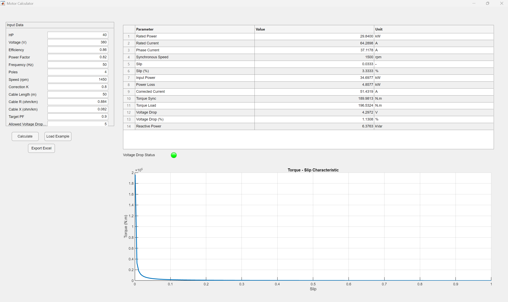
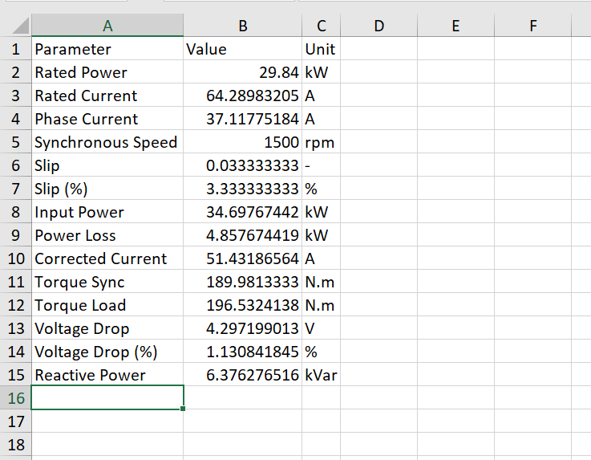

# MATLAB Motor Calculation App

MATLAB application for basic three-phase induction motor calculations.

## Features

- Rated current calculation
- Synchronous speed
- Slip calculation
- Torque calculation
- Voltage drop estimation
- Power factor correction
- Torque–Slip graph
- Excel report export
  ## 📊 Kết quả dự án

### Giao diện ứng dụng
Đây là giao diện điều khiển và tính toán thông số động cơ:

### Bảng kết quả chi tiết
Dữ liệu tính toán được xuất ra định dạng Excel chuyên nghiệp:

## Requirements

MATLAB R2023 or newer.

## Files

src/motor_app.m  
GUI application

src/motor_calc.m  
Motor calculation function

## Run the application

Open MATLAB and run:

motor_app

## Example Input

HP = 40  
Voltage = 380 V  
Efficiency = 0.86  
Power Factor = 0.82  
Frequency = 50 Hz  

## Author

Khanh  
Faculty of Electrical and Electronics Engineering
